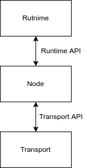

# Architecture Overview

This section describes the high level code and subsystem architecture of the
fractal host.  It will explain design designs and any forseen complexities
and challenges.  

The fractal host is responsible for the following core responsibilities:

- Validation of L3 blocks
- Construction and validation of L2 blocks
- Finality of L2 blocks (and by association L3 blocks)
- Proof generation and merging of L3 and L2 blocks

A blockchain network is composed of nodes.  Different nodes have different
responsibilities.  Validators are responsible for constructing and validating
L2 and L3 blocks. Proof generators are responsible for creating and merging
proofs attesting to the integrity of state transitions in L2 and L3 blocks.
The nodes in the network fulfil these responsibilities utilising a layered
software architecture and modular subsystem design.  

The layers of the
architecture are:

- Runtime
- Node
- Transport

  

The runtime is responsible for defining the state transition logic.  The
state transition logic defines the rules that describe  the validity of
a state transition.  The runtime logic is composed of a number of modules,
each with their own storage, state transition logic and entry points.  
Modules can interoperate via invocation of their entry points.  The node
can make calls into the runtime via the runtime API. For example when a  
validator receives a new  block via the transport layer, it will pass the
block to the runtime to ensure it is valid.  Runtime blocks contain extrinsics
these are payloads that originate from external sources, for example a users
transaction.  These extrinsics specify an entry point of the runtime they want
to invoke and contain data which is passed to the entry points as arguments.

The node is responsible for storage, data availability, validity, consensus,
finality and voting.  As the node has a large number of responsibilities,
the software is structured in a modular fashion composed of subsystems.  
Subsystems are long-lived workers that take responsibility for a particular
action.  There is then an overseer that manages communication between
subsystems. The nodes subsystems can be broadly divided into two categories
core and networking.  The networking subsystems are responsible for fetching
and distributing information between nodes but has no visibility about how
this information is used.  The core subsystems are responsible for using this
information to progress the blockchain via consensus, finality, voting etc.

The runtime and the node are heavily dependent on each other.  The runtime
depends on the node to combine extrinsics and author blocks.  The node
relies on the runtime to signal which actions to take.
