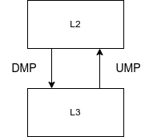
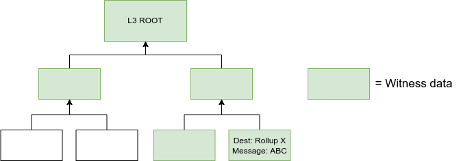

# Messaging Overview

Fractal has capabilities for both vertical and horizontal message passing.  
Vertical message passing (VMP) is the process of passing messages between L2
and the L3's.  Horizontal message passing (HMP) is responsible for passing
messages between L3's.  The messaging protocol is implemented in such a way
that enables validity proofs to be produced that attests to the integrity of
messages.

## Vertical Message Passing

  

Downward messaging passing (DMP) is a mechanism for delivering messages from L2
to L3. Each L3 has it's own queue that stores all pending inbound downward
messages.  The L3's runtime logic defines how these messages will be consumed.
They do not need to be consumed all at once.  The downward message passing
queue does not have a cap.  The core protocol will use DMP to pass two primary
pieces of information from L2 to L3, these being L3 deposits and state roots
of the other L3's on the platform.  L3 deposits are self explanatory.  The
requirement for consumption of L3 state roots is to enable secureHMP across
L3's.

Upward message passing (UMP) is a mechanism for delivering messages from L3 to
L2.  The protocol will use UMP to pass summary data related to new blocks, this
will include but is not limited to block hash, parent hash, new state root and
account updates.

## Horizontal Message Passing

HMP is a message passing mechanism that enables secure cross L3 messaging with
minimal involvement from L2.  As discussed in VMP above we mentioned that the
state root of every L3 is pushed to every other L3.  A source L3 then generates
a message and sends it via a messaging channel to another L3.  The message hash
is included in the state tree of the source L3. When the message arrives at the
destination L3 can authenticate the message indeed came from the source L2
using the known state root of the source L3 and additional message
authentication witness data.  The witness and message data will be encoded into
the same message blob.  The witness can be authenticated within the zkvm and
this allows for cryptographically secured cross L3 messaging.

  

