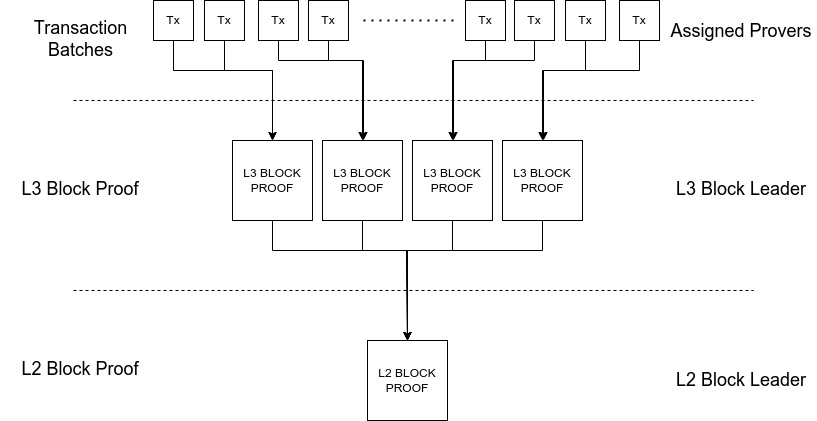

# Decentralised Proving Process

## Overview

Decentralised proving is a process by which validity proofs associated with
the state transitions of the zero-knowledge virtual machine are generated in parallel.
The purpose of the decentralised proving process is to ensure reliable, timely
and correct generation of validity proofs.  This is achieved via crypto-economic constructs
such as staking, rewards and slashing.  Generation of validity proofs is a highly 
parallelisable process.  Parallelisation is achieved across two dimensions, threads and machines, 

L2 relay chain blocks contain headers of a set of L3 blocks.  Once a L2 relay chain block is
considered final then the decentralised prover set should begin to generate proofs attesting
to state transitions associated with the L2 and L3 blocks.  Parallelisation is achieved by 
assigning decentralised provers a subset of transactions they are responsible for proving.  

The decentralised provers are assigned to a particular block for each session.  The (n) provers
are assigned equitably across the (x) blocks such that there are n / x provers per block.  This
assignment processes is orchestrated by the session module.  The prover assignment is rotated 
each session.

The proving is achieved by fetching the block code via a runtime call, fetching the PoV 
block via the availability subsystem and then finally executing the `prove` entry point of the 
code block whilst specifying desired transaction range for proving.  The `prove` logic will 
execute proof generation via a host function call which will parallelise proof generation across
cores.  Once the proofs have been generated they will be gossiped across the gossip network.  A
block leader will be assigned for each session and it is their responsibility to combine batches
proofs into a block level proof.  Once the block level proof is constructed this will be gossiped
and the L3 block producer will be responsible for verifying and combining these proofs into a 
combined L2 block proof. 

